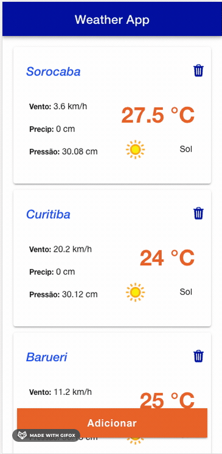
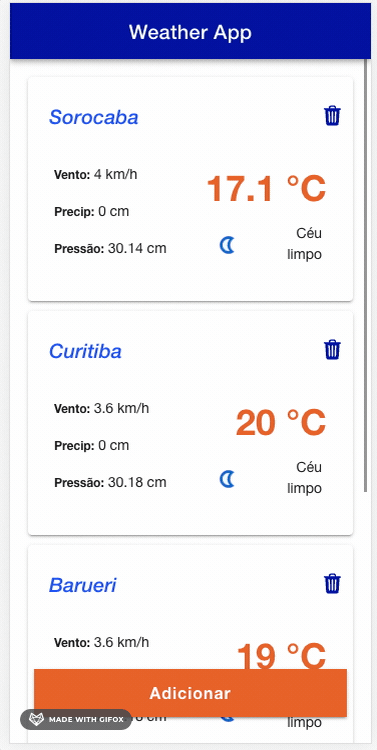
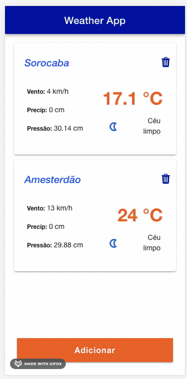

# Weather App

Este é um aplicativo de previsão do tempo desenvolvido em Ionic. Ele permite aos usuários obter informações atualizadas sobre o clima de diferentes cidades.

## Funcionalidades

- Visualização do clima atual de várias cidades
- Adição de novas cidades à lista
- Remoção de cidades da lista

## Pré-requisitos

Antes de executar o aplicativo, certifique-se de ter instalado o seguinte:

- Node.js (versão ˆ16.0.0)
- Ionic Framework (versão ^7.0.0)

## Instalação

1. Clone este repositório em sua máquina local:

```sh 
git clone https://github.com/eugeniobarrosjr/weather-app-privaty.git
```

2. Navegue até o diretório do projeto:

```sh 
cd weather-app
```

3. Instale as dependências do projeto:

```sh 
yarn intall
```

4. Acesse o site https://www.weatherapi.com/my/, e adquira uma API Key

5. Adicione a sua API Key em `src/enviroments/enviromentts.ts`, seguindo o modelo.


## Executando o aplicativo

Para executar o aplicativo, utilize o seguinte comando:
```sh
ionic serve
```

## Testes

Para executar os testes automatizados do projeto, utilize o seguinte comando:

```sh
yarn test
```

## Screenshots




